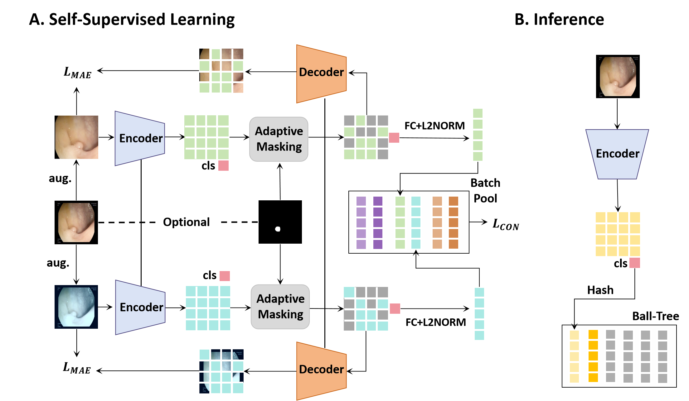

# EndoFinder: Online Image Retrieval for Explainable Colorectal Polyp Diagnosis

recently accepted to [MICCAI 2024](https://).

This work employs self-supervised contrastive learning combined with a polyp-aware masked reconstruction task to learn a universal representation of polyps for image retrieval.

<div align="center">
  
</div>

## Pretrained models

We provide trained models from our original experiments to allow
others to reproduce our evaluation results ().

### Option 1: Install dependencies using Conda

Install and activate conda, then create a conda environment for EndoFinder as follows:

```bash
# Create conda environment
conda create --name EndoFinder -c pytorch -c conda-forge \
  pytorch torchvision cudatoolkit=11.3 \
  "pytorch-lightning>=1.5,<1.6" lightning-bolts \
  faiss python-magic pandas numpy

# Activate environment
conda activate EndoFinder

# Install Classy Vision and AugLy from PIP:
python -m pip install classy_vision augly
```

### Option 2: Install dependencies using PIP

```bash
# Create environment
python3 -m virtualenv ./venv

# Activate environment
source ./venv/bin/activate

# Install dependencies in this environment
python -m pip install -r ./requirements.txt --extra-index-url https://download.pytorch.org/whl/cu113
```

## Inference using EndoFinder models

This section describes how to use pretrained EndoFinder models for inference.

### Preprocessing

We recommend preprocessing images for inference either resizing
the small edge to 224 or resizing the image to a square tensor.

```python
from torchvision import transforms

normalize = transforms.Normalize(
    mean=[0.485, 0.456, 0.406], std=[0.229, 0.224, 0.225],
)
small_224 = transforms.Compose([
    transforms.Resize(224),
    transforms.ToTensor(),
    normalize,
])

```

### Inference using Torchscript

Torchscript files can be loaded directly in other projects without any SSCD code or dependencies.

```python
import torch
from EndoFinder.tools.img2jsonl import LoadModelSetting
from PIL import Image

model = LoadModelSetting.get_model(LoadModelSetting['vit_large_patch16'], "/path/to/EndoFinder.pth", use_hash=False)
img = Image.open("/path/to/image.png").convert('RGB')
batch = small_224(img).unsqueeze(0)
embedding = model(batch)[0, :]
```

### Load model weight files

To load model weight files, first construct the `Model` object,
then load the weights using the standard `torch.load` and `load_state_dict`
methods.

```python
import torch
from EndoFinder.models import models_vit

model = models_vit.__dict__["vit_large_patch16"](use_hash=False)
checkpoint = torch.load("/path/to/EndoFinder.pth", map_location='cpu')
checkpoint_model = checkpoint['model']
model.load_state_dict(checkpoint_model, strict=False)
model.eval()
```

## Reproducing evaluation results

To reproduce evaluation results, see [Evaluation](docs/Evaluation.md).

## Training EndoFinder models

For information on how to train EndoFinder models, see 
[Training](docs/Training.md).

## License


## Citation

If you find our codebase useful, please consider giving a star :star: and cite as:

```
@article{pizzi2022self,
  title={A Self-Supervised Descriptor for Image Copy Detection},
  author={Pizzi, Ed and Roy, Sreya Dutta and Ravindra, Sugosh Nagavara and Goyal, Priya and Douze, Matthijs},
  journal={Proc. CVPR},
  year={2022}
}
```
